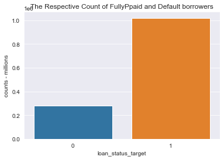
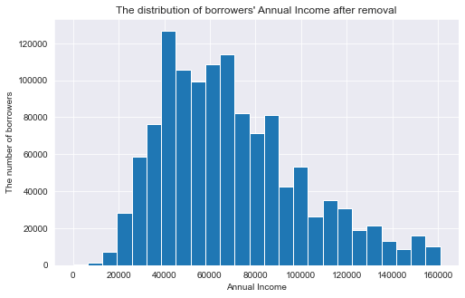
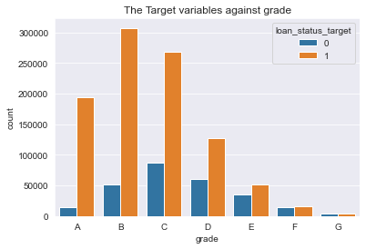
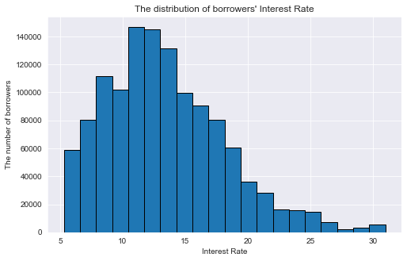
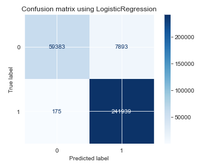
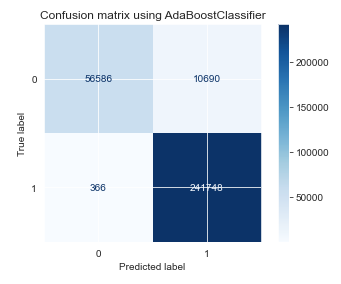
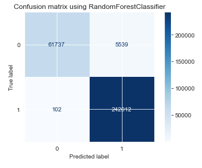

# Machine Learning prediction of loan default on Lending Club Data

# Executive Summary 

The internet has become a large part of our life.  We shop for our food, cloths and home hold items online.  Why not look for a loan?

Lending Club is a peer-to-peer lending company with its headquarters in San Francisco, California. They began by operating as an online consumer-lending platform that allows borrowers to obtain unsecured loans that are funded by individual investors.  Investors are able to search and browse the loan listings on Lending Club website and select loans that they want to invest in based on the information supplied about the borrower, amount of loan, loan grade, and loan purpose. 

 
## Problem Statement:
This is my project using Lending Tree data to predict whether a borrower will default on a loan using multiple machine learning algorithms.

## Exploratory Data Analaysis (EDA) and Data Cleaning:
We will evaluate the loans from 2007 to 2017 publicly shared data from Lending Club. Lending Club provides a data dictionary that contains details of all attributes of in the dataset. We used that dictionary to understand more about the data columns, and we will remove columns that do not impact the loan default ratio.

While conducting EDA for this project, we found a large number of columns missing data, some with partial data, and duplicate rows.  We removed them because most algorithms do not accept null values. We cleaned the data using industry standard algorithms to remove bad or missing data.

## Target Variables:
We evaluated each of the values of Loan Status features.  We decided that our target variable - Fully Paid and Default.  Loans that were currently still being paid we removed, because they are not in either state.  Loans that were charged off as bad debt were grouped with Default loans.

## Annual Income:
The borrow income ranged from $32 to $11m, with a majority of the borrowers earning less than $175k annually. We calculated the lower and upper limits and removed all the data points beyond our upper limit of $161k.  

We re-ran the histogram after removing the outliers and noticed that the income clustered between $40k and $75k.  The median borrower income is $65k.  

## Grade and Interest Rate of each loan:
For each loan, we have two basic attributes: grade and interest rate. In Lending Club, loan grade is given a letter A-G that is assigned to a borrower and corresponds with the interest rate that is charged for the loan.  The rate of "A" is the highest with a value of 7 and "G" the lowest with a value of 1.  The higher the expected risk of default, the higher the interest rate is set in order to offset this risk.

The maximum interest rate was 30.9%, the lowest was 5.3% and median 12.85%. Grade "C" had the highest default rate. Lending Club charges 5% base as a base interest to each loan, and then adds the risk percentage.

**43% of Default borrowers had interest rate of 20% or greater, and median income of $65k annually.**

## Years of Employment
The length of employement included single years, and 10+ years.  A large number of borrowers who defaulted were in this category, but they were also the largest cohort of borrowers.

There were 8% of the borrowers with 0 years of employment.  We noticed that employment length of 0 and 1 have high default rates.

## Confusion Matrixes for Data Science Algorithms Used:

### Logistic Regression
Logistic Regression was chosen as one of the models because it predicts a single outcome, and is very fast. Since we are trying to predict if someone will default or not, that makes this is a good algorithm for this problem.

- Accuracy training score: 97.4%   
- Accuracy testing score:  97.39%

### Ada Boost
We chose AdaBoost because our target feature was heaviliy imbalanced to paid loans, and we wanted to try an algorithm to balance a binary classification. This algorithm is also not prone to overfitting.

- Accuracy training score: 96.4%
- Accuracy testing score:  96.4%

### KNNeighbors
KNNeighbors is one of the simplest and a very accurate algorithm.  It calculates the distance of neighboring data points to predict accuracy. The algorithm determines features that have a high relevancy based upon distance to neighboring points.

There is some overfitting, maybe because we did not balance the data prior to modeling. 

- Accuracy training score: 100%
- Accuracy testing score:  97.8% 

### Random Forest Classifier
Random Forest does not have any assumptions about distribution, and uses random sets of features to build trees for scoring the model. It is a forest of individual trees, trained on different subsets of the training data, each with its own predictions.  The highest scoring prediction becomes the model's prediction, and usually results in a high accuracy score.

- Accuracy training: 99.4%        
- Accuracy testing:  98.1%

## Conclusions 
We used four algorithms with the intention of choosing the best model based on accuracy.  
RandomForestClassifier was chosen because it successful predicted borrowers that would default on their loan. The model also has a very low misclassification.

## Recommendations
We recommend that Lending Club re-evaluate its grade scale / interest rates. Some borrowers making 65k are defaulting on loans, but you do not want to introduce bias against this income bracket.  Therefore, the grading system needs to be restricted to the actual data, not simply a target income bracket. 

# References

All data used in this notebook can be found inn this [PublicDataScience OneDrive](https://1drv.ms/f/s!Auk8iMVy_DM2gvABhoALt3I8kw1-XA)

[How to fine tune Random Forest](https://towardsdatascience.com/random-forest-hyperparameters-and-how-to-fine-tune-them-17aee785ee0d)

[Hyperparamter Tuning Random Forest](https://www.analyticsvidhya.com/blog/2020/03/beginners-guide-random-forest-hyperparameter-tuning/)

